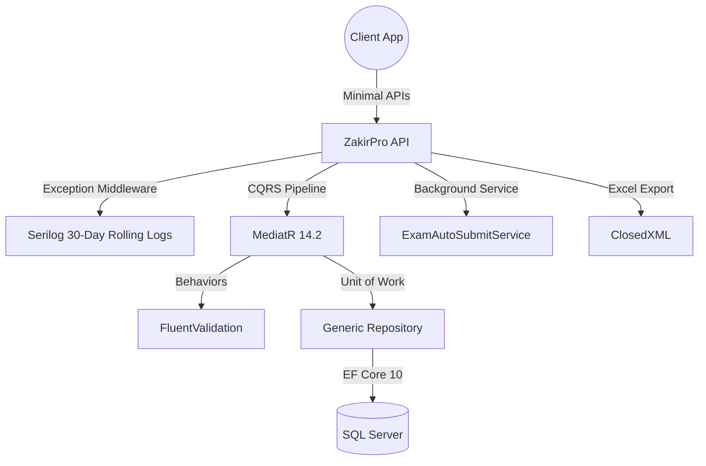

# 📚 ZakirPro

[](https://dotnet.microsoft.com/)
[](https://docs.microsoft.com/en-us/dotnet/csharp/)
[](https://docs.microsoft.com/en-us/ef/core/)
[]()

**ZakirPro** is a bleeding-edge, production-grade school management API built on **.NET 10**. Architected with Clean Vertical Slices and CQRS, it offers advanced role-based access control, automatic exam submission via background services, comprehensive audit logging, and dynamic Excel exports.

## 🏗️ Architecture & Flow



## ✨ Features

| Feature | Description |
|---------|-------------|
| **.NET 10 Innovation** | Built utilizing the latest .NET 10 SDK for maximum performance and modern C# features. |
| **Role-Based Access** | Deep hierarchy supporting SuperAdmin, Admin, Teacher, Assistant, and Student workflows. |
| **Auto-Submit Service** | Hosted background service (`ExamAutoSubmitService`) that automatically submits expired exams. |
| **Audit Logging** | Comprehensive action tracking via `IAuditLogger` for security and compliance. |
| **Excel Export** | Dynamic generation and export of data to Excel spreadsheets using `ClosedXML`. |
| **Clean CQRS Architecture**| Endpoints, Abstractions, Behaviors, and Infrastructure layers cleanly decoupled. |
| **Robust Logging** | Global exception handling middleware paired with Serilog rolling file logs (30-day retention). |

## 🛠️ Tech Stack

| Category | Technology |
|----------|------------|
| **Framework** | .NET 10.0, ASP.NET Core Minimal APIs |
| **Architecture** | CQRS, Clean Vertical Slice |
| **Data Access** | Entity Framework Core 10, SQL Server, Unit of Work & Generic Repository |
| **Security** | JWT Bearer Authentication 10 |
| **Libraries** | MediatR 14.2, FluentValidation 12, ClosedXML, MailKit 4.17, Serilog |
| **Background Processing** | ASP.NET Core Hosted Services |

## 📂 Project Structure

```text
ZakirPro/
├── Abstractions/        # Core interfaces (IAuditLogger, ITokenService, etc.)
├── BackgroundServices/  # Hosted services (ExamAutoSubmitService)
├── Behaviors/           # MediatR pipeline behaviors (ValidationBehavior)
├── Endpoints/           # Minimal API endpoints by feature slice
├── Infrastructure/      # Implementations (AuditLogger, JwtService, Repositories)
├── Models/              # Domain entities (User, Admin, Teacher, Exam, etc.)
└── Program.cs           # .NET 10 bootstrapper, Seeder, and Middleware setup
```

## 🚀 Getting Started

To get the project up and running locally, execute the following commands:

```bash
git clone https://github.com/OmarAlfar0uk/ZakirPro.git
cd ZakirPro
dotnet restore
dotnet run
```

---
**Author**  
GitHub: [OmarAlfar0uk](https://github.com/OmarAlfar0uk) | LinkedIn: [omar-alfarouk-252471251](https://www.linkedin.com/in/omar-alfarouk-252471251/) | Email: [omaralfarouk646@gmail.com](mailto:omaralfarouk646@gmail.com)
