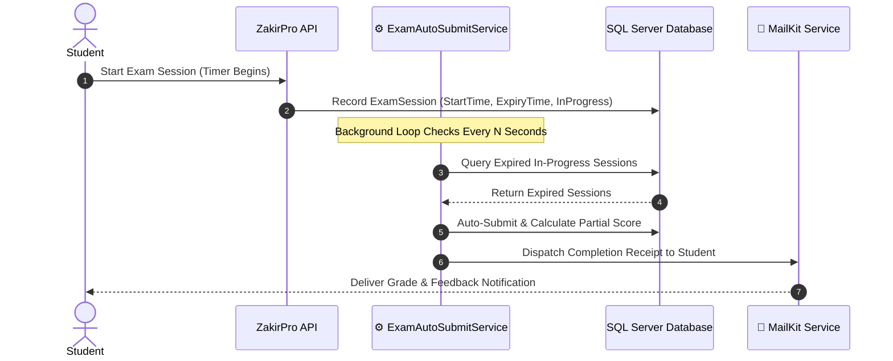

<div align="center">

# 🧠 ZakirPro
### Enterprise Examination Management & Automated Assessment Platform

[](https://dotnet.microsoft.com/)
[](https://learn.microsoft.com/en-us/dotnet/csharp/)
[](#-background-services)
[](#-system-architecture)
[](LICENSE)
[](https://github.com/OmarAlfar0uk)

<p align="center">
  <a href="#-key-features">Key Features</a> •
  <a href="#-background-services">Background Services</a> •
  <a href="#-tech-stack">Tech Stack</a> •
  <a href="#-project-structure">Project Structure</a> •
  <a href="#-getting-started">Getting Started</a> •
  <a href="#-author">Author</a>
</p>

</div>

---

## 📌 Executive Overview

**ZakirPro** is a comprehensive educational testing and assessment management system architected for schools, universities, and certification bodies. Built on ASP.NET Core with strict adherence to Clean Architecture, ZakirPro automates the end-to-end lifecycle of student examinations—from randomized question generation and timed test-taking sessions to real-time auto-submission and instant grading.

> [!NOTE]
> Features an autonomous **`ExamAutoSubmitService`** background worker running on .NET's `IHostedService`, guaranteeing timed exam integrity even if students disconnect or navigate away.

---

## ✨ Key Features

| ⚡ Feature | 💡 Description | 🛠 Engineering Detail |
|---|---|---|
| **⏱️ Autonomous Exam Auto-Submit** | Background enforcement of strict test expiration times | Background worker (`ExamAutoSubmitService`) auditing active sessions |
| **🔐 Stateless JWT Authentication** | Granular role-based authorization for Students & Instructors | Custom `JwtService` issuing cryptographic tokens with claim enforcement |
| **📁 Secure File Storage Service** | Attachments, diagrams, and exam resource upload | Abstracted `IFileService` with content-type verification and hashing |
| **📧 Automated Email Dispatch** | Exam invitations, submission receipts, and report cards | Integrated with MailKit via `MailKitEmailService` for asynchronous delivery |
| **📊 Real-Time Analytics & Scoring** | Immediate automated evaluation of multiple-choice & numerical questions | Mathematical calculation engine with audit log retention |

---

## ⚙️ Background Services

The core differentiator in ZakirPro is its resilient background worker orchestration:



---

## ⚡ Tech Stack

| Category | Technology | Purpose |
|---|---|---|
| **Core Platform** |   | High-performance Web API and asynchronous task host |
| **Background Processing** |  | Scheduled cron and background exam session evaluation |
| **Database & ORM** |   | Relational model storage, migrations, and transactional updates |
| **Security & Identity** |  | Secure token management via `ITokenService` / `JwtService` |
| **Mailing** |  | Production-grade MIME-based email transport |

---

## 📂 Project Structure

```text
ZakirPro/
├── ZakirPro/
│   ├── Common/
│   │   ├── Abstractions/         # Contracts (ITokenService, IEmailService, IFileService)
│   │   ├── BackgroundServices/   # ExamAutoSubmitService (IHostedService worker)
│   │   ├── Extensions/           # Dependency injection & service registration
│   │   └── Infrastructure/       # Concrete implementations (JwtService, MailKitEmailService)
│   ├── Controllers/              # RESTful API Controllers
│   ├── Data/                     # ApplicationDbContext, Model Configurations & Migrations
│   ├── Models/                   # Domain Entities (Exam, Question, Submission, User)
│   └── Program.cs                # Entry point, services pipeline, hosted service registration
└── ZakirPro.sln                  # Visual Studio Solution
```

---

## 🚀 Getting Started

### Prerequisites
- [.NET 8.0 SDK](https://dotnet.microsoft.com/download/dotnet/8.0)
- SQL Server (LocalDB or Docker)

### Setup Instructions

1. **Clone the repository:**
   ```bash
   git clone https://github.com/OmarAlfar0uk/ZakirPro.git
   cd ZakirPro
   ```

2. **Restore & Build Solution:**
   ```bash
   dotnet restore
   dotnet build
   ```

3. **Run the Application:**
   ```bash
   dotnet run --project ZakirPro
   ```

---

## 👨‍💻 Author

**Omar Alfarouk**  
*Full-Stack .NET & Software Engineer*  

- 🌐 **GitHub:** [@OmarAlfar0uk](https://github.com/OmarAlfar0uk)
- 💼 **LinkedIn:** [omar-alfarouk](https://www.linkedin.com/in/omar-alfarouk-252471251/)
- 📧 **Email:** [omaralfarouk646@gmail.com](mailto:omaralfarouk646@gmail.com)

---

<div align="center">
  <sub>Built with ❤️ by Omar Alfarouk. Licensed under the <a href="LICENSE">MIT License</a>.</sub>
</div>
